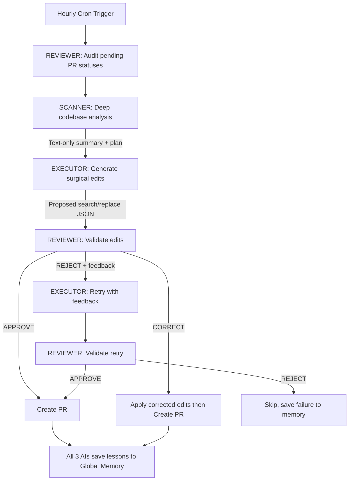

# Mayo 🦾🤖
### The Autonomous Triple-AI Maintainer

Mayo is a **Self-Improving Autonomous Maintenance Engine** integrated directly into your GitHub ecosystem. It uses a **Triple-AI Pipeline** — three specialized AI models working in concert — to produce high-value, validated code improvements across all your repositories.

---

## 🧬 Triple-AI Pipeline

Every improvement goes through 3 AI models before it becomes a PR:

| Role | Model(s) Used | Purpose |
|---|---|---|
| 🔭 **Scanner** | Fireworks AI (Llama 3.3 70B), Gemini 2.5 Flash | Reads full codebase → text-only analysis (zero compaction risk) |
| ⚡ **Executor** | Fireworks AI (Llama 3.3 70B), Groq (Llama 3.1 8B), Gemini 2.5 Flash | Receives plan → produces surgical search/replace edits |
| 🛡️ **Reviewer** | Gemini 2.5 Flash | Validates edits, corrects mistakes, audits PR review history |
| 🆕 **NewCrons** | Fireworks AI (Llama 3.3 70B), Gemini 2.5 Flash | Handles timed phases (PR/issue judging, proactive issues, discussions) |

---

## 🧠 Cross-Repo Global Memory

Unlike standard AI bots, Mayo has **persistent memory**:
- Tracks successes, failures, and "lessons learned" across all repositories.
- Insights from Repo A directly improve work on Repo B.
- The Reviewer audits real PR states (merged/closed/commented) and updates memory automatically.

---

## 🩺 Surgical Precision

The Executor uses a **Search/Replace block system** (max 10 lines per block). This guarantees:
- **100% preservation** of your original code structure.
- **Zero hallucination** of unrelated code.
- **Validated PRs** — every edit is reviewed by the Reviewer before creation.

---

## 🏗️ Analysis Depth

The Scanner performs a rigorous multi-layered analysis:
1. **Security**: Injections, hardcoded secrets, missing validation
2. **Logic**: Edge cases, null checks, error handling
3. **DX**: Missing READMEs, build guides, setup docs
4. **Performance**: Redundant calls, memory leaks
5. **Consistency**: Naming, patterns, style
6. **Creative**: Proactive "expert touches"

---

## ⚙️ Setup & Deployment

> **⚠️ FORK BEFORE USING**
> 
> This repo contains hardcoded references to my personal accounts, API keys, GitHub App configuration, and other credentials scattered throughout the codebase. **Do not use this repo directly.**
> 
> To use Mayo:
> 1. **Fork this repo**
> 2. **Search and replace** all personal references:
>    - `HOLYKEYZ` → your GitHub username
>    - `ayandajoseph390@gmail.com` → your email
>    - `joe-gemini-bot` → your bot name
>    - `mayo` → your bot repo name
>    - All API keys/env vars → your own keys
> 3. **Set up your own GitHub App** and add secrets to your repo
> 4. **Update the workflow file** (`.github/workflows/cron.yml`) with your secrets

### Environment Variables
| Variable | Purpose |
|---|---|
| `GEMINI_API_KEY` | Scanner (Gemini A) |
| `GEMINI2_API_KEY` | Reviewer (Gemini B) |
| `GROK_API_KEY` | Executor (Llama 3.3 70B via Groq) |
| `APP_ID` / `PRIVATE_KEY` | GitHub App authentication |
| `CRON_SECRET` | Hourly trigger authorization |

### Deployment
1. Deploy as a **GitHub App** on **Vercel**.
2. Point webhook to `https://your-app.vercel.app/webhook`.
3. Install on your repositories.
4. The hourly cron (`.github/workflows/cron.yml`) handles the rest.

---

## ℹ️ Author
Created by **Joseph (@HOLYKEYZ)**. Advanced agentic engineering for autonomous codebase maintenance.

Happy coding! 🚀 (v3.0 — Triple-AI)
